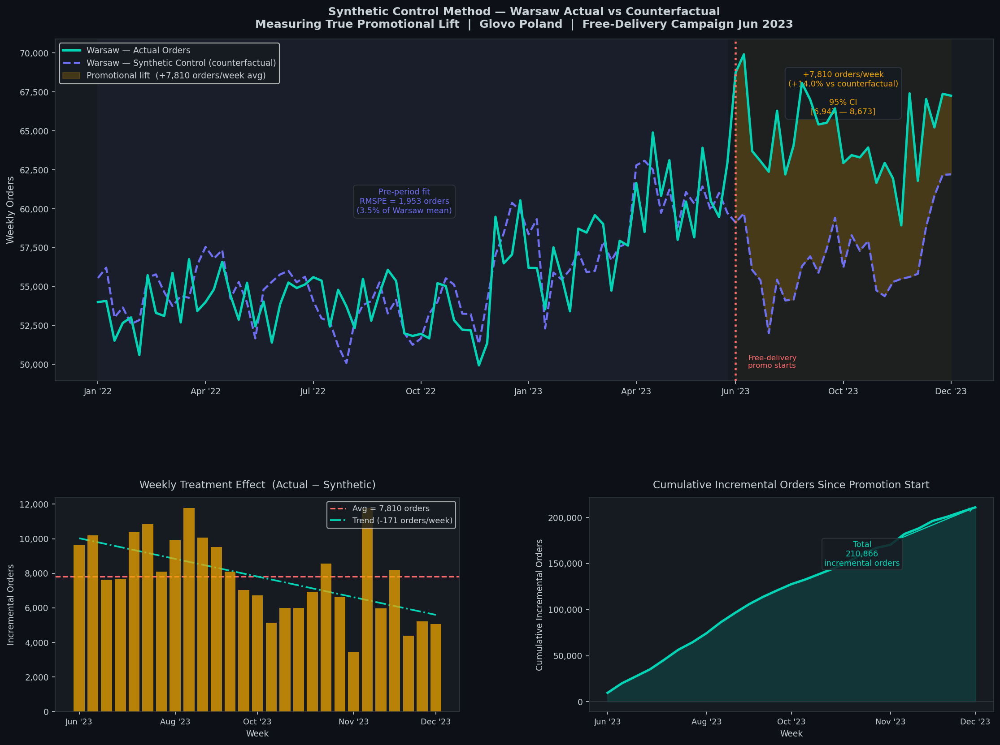
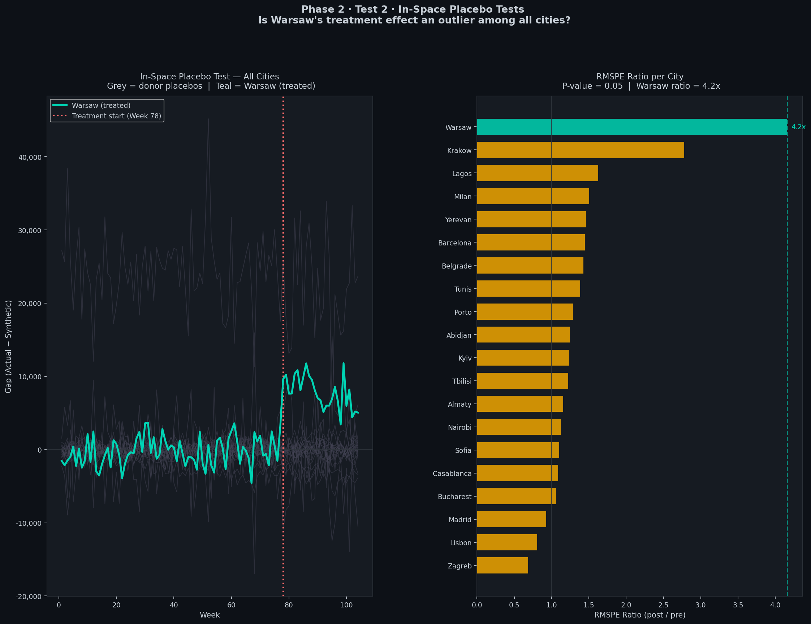
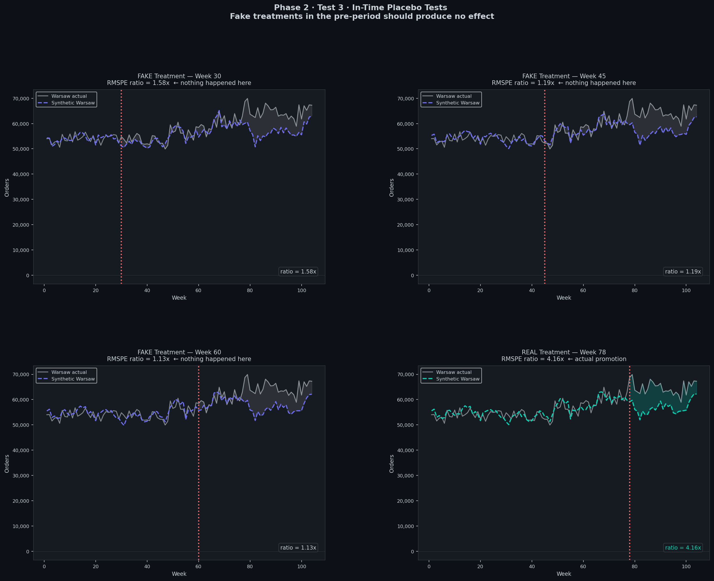

**Step 1 — Data simulation:** Realistic city-level weekly panel data across 20 Glovo operating cities, modelled on actual market structures (monopoly vs competitive), purchasing power parity (€6–24 AOV range), and city-specific growth rates.

**Step 2 — Dataprep:** Define treated unit (Warsaw), donor pool (19 cities), predictor variables (`orders`, `aov_eur`, `new_users`, `reorder_rate`), and training window (weeks 1–77).

**Step 3 — Weight optimisation:** Solve constrained quadratic optimisation to find W minimising pre-period RMSPE across predictors.

**Step 4 — Treatment effect:** ATT = mean(actual Warsaw − synthetic Warsaw) over weeks 78–104.

**Step 5 — Assumption testing:** RMSPE ratio, in-space placebos (p-value), in-time placebos, predictor sensitivity.

---

## Assumption Validation

| Test | Question | Result |
| --- | --- | --- |
| Pre-period RMSPE | Is the synthetic control a credible replica of Warsaw? | 3.5% of mean |
| RMSPE ratio | Is the post-period gap large vs pre-period noise? | 4.16x |
| In-space placebos | Is Warsaw's effect unusual among all cities? | p = 0.05 |
| In-time placebos | Is the effect specific to the real treatment date? | Fakes: 1.1–1.6x |
| Predictor sensitivity | Does the conclusion hold across predictor sets? | 8.8% variation |

---

## Visualisations

### Actual vs Synthetic Warsaw : The Hero Plot



### In-Space Placebo Tests



### In-Time Placebo Tests



---

## Core Finding

> *Warsaw's free-delivery promotion generated a true causal lift of +7,810 orders/week (+14% vs counterfactual), producing 210,866 incremental orders over 27 weeks. The synthetic control achieved 3.5% pre-period RMSPE. The treatment effect is 4.16x larger than pre-period noise, statistically rare among all 19 donor city placebos (p=0.05), absent at all fake treatment dates, and stable across five predictor specifications with only 8.8% variation. The result is robust.*

---

## Stack

Python · pysyncon · pandas · matplotlib · NumPy

---

## Data

Dataset is simulated using insider knowledge of Glovo's real city-level KPIs: order volumes, AOV, and market structure across actual Glovo operating countries (Spain, Italy, Portugal, Poland, Romania, Ukraine, Bulgaria, Serbia, Croatia, Georgia, Armenia, Kazakhstan, Morocco, Kenya, Nigeria, Tunisia, Côte d'Ivoire).

The simulation embeds a known true treatment effect (+13% peak → +8% floor, decaying) which the model recovers, validating the implementation.

The raw CSV files are not included in this repository. Run `data/simulate_glovo_panel.py` to regenerate them.

---

## Reproducing Results

```bash
# Clone the repo
git clone https://github.com/Bahakahri/synthetic-control
cd synthetic-control

# Install dependencies
pip install -r requirements.txt

# Generate the dataset
python data/simulate_glovo_panel.py

# Run the notebook
jupyter notebook notebooks/synthetic_control.ipynb
```

---

## Limitations

- Data is simulated : results validate the methodology, not a specific real-world campaign
- With 20 cities, the minimum achievable p-value is 0.05 (1/20). Larger donor pools would allow more precise inference
- Common trends assumption is validated but not proven : it cannot be directly tested
- Krakow's elevated placebo ratio (2.78x) is consistent with geographic proximity spillover and high donor weight. it does not invalidate the Warsaw result but is worth monitoring in a real deployment

---

## Related Projects

- [Project 1 — Causal Uplift with DMLIV](https://github.com/Bahakahri/causal-uplift-dmliv): Estimating heterogeneous ad effects using Double ML with Instrumental Variables on the Criteo incrementality dataset
